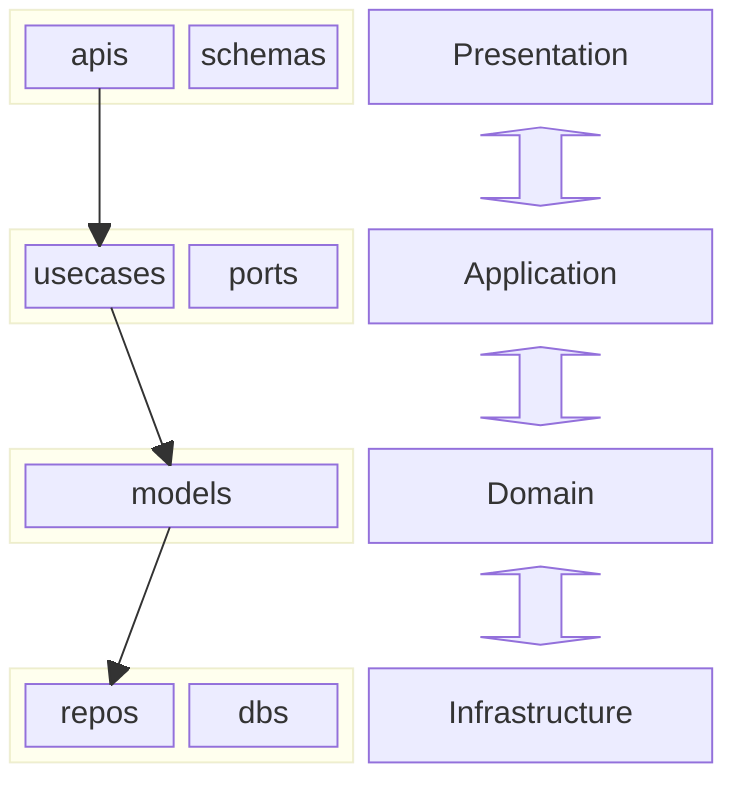

# Application Topology

## Source Tree

```sh
├── build                           # Compiled files (sometimes named 'dist' or 'bin')
├── docs                            # Project documentation
│   ├── CONTEXT.md      
│   └── APPLICATION_TOPOLOGY.md
├── src                             # Actual source code files
│   ├── apis
│   │   └── __init__.py   
│   ├── usecases
│   │   └── __init__.py   
│   ├── ports
│   │   ├── uow.py                  # Unit Of Work
│   │   └── __init__.py  
│   ├── models
│   │   └── __init__.py   
│   ├── services
│   │   └── __init__.py   
│   ├── repos                       # Database bridge, ORM wrapper
│   │   └── __init__.py             
│   ├── schemas                     # Like Dtos
│   │   └── __init__.py             
│   ├── dbs                          
│   │   └── __init__.py   
│   ├── __init__.py
│   └── main.py                     
├── tests                           # Automated tests
├── tools                           # Utility scripts or build tools
├── LICENSE                         # License file
└── README.md                       # Project overview and instructions
```

## Bounded Context


