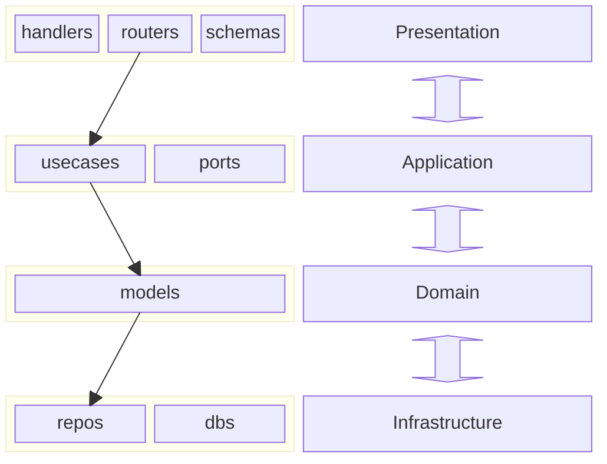

# Application Topology

## Source Tree

```sh
├── target                           # Compiled files (sometimes named 'dist' or 'bin')
├── docs                            # Project documentation
│   ├── CONTEXT.md      
│   └── APPLICATION_TOPOLOGY.md
├── src                             # Actual source code files
│   ├── routers
│   │   └── identities.rs     
│   ├── handlers
│   │   └── identities.rs  
│   ├── handlers.rs                     
│   ├── routers.rs                     
│   └── main.rs                     
├── tests                           # Automated tests
├── tools                           # Utility scripts or build tools
├── LICENSE                         # License file
└── README.md                       # Project overview and instructions
```

## Bounded Context


